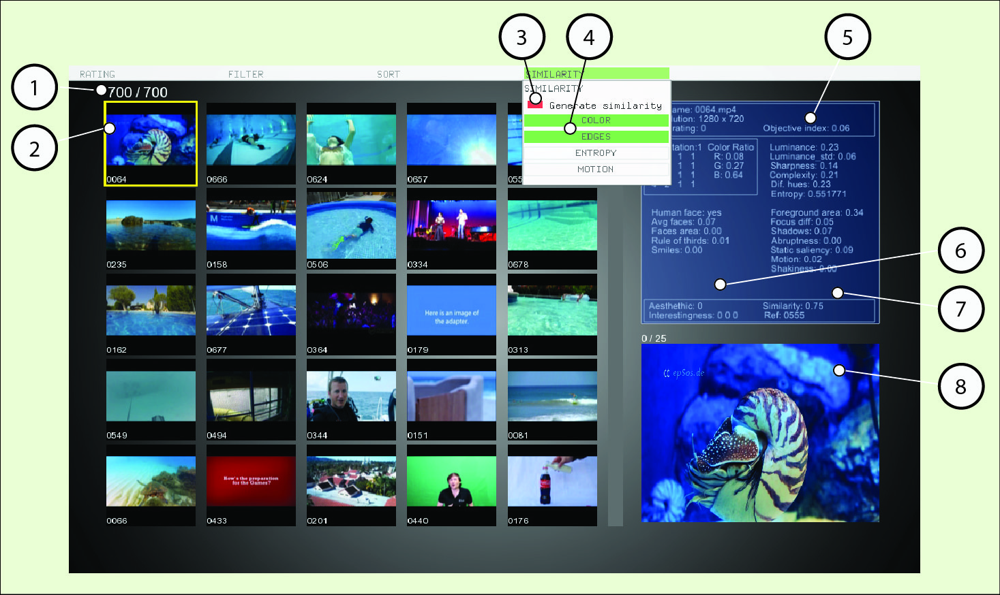

# Graphical Interface Instructions

There was a need to create a usable test system for development and assessment of new research ideas. It was developed a prototype application  to test performance and usability of the visual features. It offers a simple way to browse and manage a video repository. It starts by loading video metadata generated by the feature extractor class, including binary prediction data generated using aesthetic and interestingness built in classifiers.


*figure 1 - Graphical interface* 

 Afterwards, an interface depicted in [figure 1]() can be accessed and used to help the user in discriminative tasks. There is a counter (1) that shows the number of videos visible versus total videos on the repository. When a video is selected its border turns green. After selecting a video, we can use the generate similarity button (3) in the similarity menu (4) to index the videos. Selecting a video also activates a panel with video metadata details (5), including binary classification (6) and similarity (7) data, and a video preview panel (8).

 
*figure 2 - Graphical interface* 

The several tool menus are visible in  figure 2.  The rating menu (1) helps the user to organize favorite files. In the filter menu (2) the user can filter by more than 20 different features, including object detection and machine learning classification data (5). It is also possible to use the sort menu (3) to sort by many features, including a multi-feature similarity measure (4).

There are 4 available menu tabs:

* RATING - With the rating tabthe user can assign a rating from 0 to 5 to some videos and afterwards filter or sort by this rating.
* FILTER 1 - In the filter tab 1 the user can filter using the basic features.
* FILTER 2 - In the filter tab 2 are grouped more advanced features.
* SORT - In this tab we can sort the videos by more then 20 different features.
* SIMILARITY - Using the similarity menu the user can generate a similarity index based on color, edge orientation, entropy or motion. This feature uses the current selected video as reference for the indexing operation. After generation of the index the user can sort by similarity using the sort tab.

## Adding a new video repository

The extractor class accepts 3 types of video file extensions:

* MP4
* MTS
* MOV

To add a new repository of videos:

* Delete all files in “data/xml” folder
* Delete all files in “data/thumbnails/videos” folder (optional step)
* Delete all files in “data/files” folder
* Put new video files in “data/files” folder
* Start application

Example:

* After deleting all files in “data/xml” folder we copied 5 videos to “data/files” folder

 

* Runing the application renders this output

 

* After the feature extraction process the graphical interface starts up

 

## Changing extraction setup

It is possible to configure the feature extraction using the extractor_config.xml file, below is
the content of this file where we can see the default values:

```
<CONFIG>
	<SAMPLING_FACTOR>1</SAMPLING_FACTOR>
	<EDGE_HIST>1</EDGE_HIST>
	<ENTRO>0</ENTRO>
	<QUIET>1</QUIET>
	<RESIZE>1</RESIZE>
	<BGSUB>1</BGSUB>
	<FLOW>1</FLOW>
	<PARSE_ONLY>0</PARSE_ONLY>
	<INPUT_FOLDER>data/files/</INPUT_FOLDER>
	<TOTAL_FILES>1000</TOTAL_FILES>
</CONFIG>
```
These are experimental configurable values, it is not recomended to change.

### SAMPLING_FACTOR = [positive integer] 
Increasing the sampling factor will skip frames during the extraction process, making it much
faster to compute. Extracting our features using a factor of 10 means that the time of the
extraction process will be 1/10 of using a factor of 1.There is a drawback, background
subtraction and optical flow features will not be extracted.

### EDGE_HIST = [0, 1] 
Turning off edge histogram will decrease sligthly computation time.

### ENTRO = [0, 1] 
Entropy computation switch for debug.

### QUIET = [0, 1] 
Turning off quiet mode will increase console feed-back from extraction process.

### RESIZE = [1, 2, 3]
 The extraction process is done on a resized version of the video frames, available options are:

* 0 - no resizing
* 1 - 320 x 240
* 2 - 480 x 360
* 3 - 640 x 480

### BGSUB = [0, 1] 
Computation of background subtraction features.

### FLOW = [0, 1] 
Computation of optical flow features

### PARSE_ONLY = [0, 1] 
Allows to bypass extraction process and start from feature vector parse phase.

### INPUT_FOLDER = [string] 
The path to folder with input videos.

### TOTAL_FILES = [positive integer] 
The total capacity.

## Error handling

The error handling and exception mechanism is not enough implemented, if the application hangs at the extraction phase, theres a great probability of existance of corrupted video files, you can inspect the output/output.csv file to try to understand wich is the damaged file and delete/recode it. When errors occur during very long extraction operations it is possible to reuse the already extracted data.

* backup the output.csv file
* delete/move the already computed videos
* restart the extraction process
* in the end concatenate all output.csv files
* put correct video file set in data/files folder (they should correspond to the thumbnails)
* change PARSE_ONLY to 1 (to bypass extraction process)
* xml folder should be empty
* restart the application
* after creation of XML files the GUI will start
* At this point switch PARSE_ONLY to 0. (back to default value)