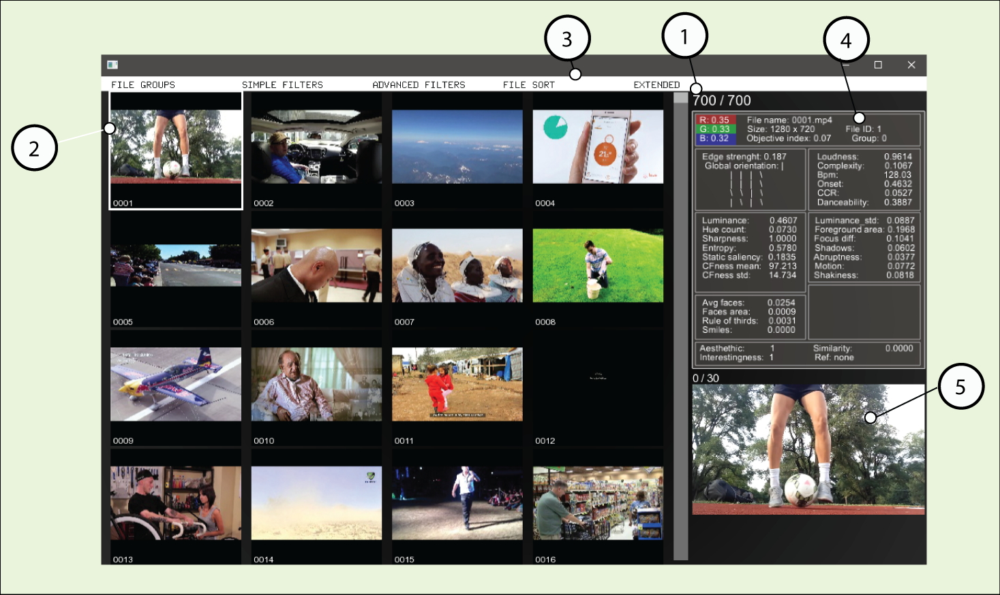

# Graphical Interface Instructions

There was a need to create a usable test facility for development and assessment of new research ideas. This graphical interface offers a simple way to browse and manage a video repository. It starts by loading visual feautures generated by the feature extractor class, including binary prediction data generated using aesthetic and interestingness built in classifiers. Simple semantic and audio features are also extracted. The application requires codecs for video (something like k-lite codec pack) and FFmpeg in the case you plan to extract audio features. The binaries should run on any x64 windows machine.
We populated this demo with the UGC videos from the [CERTH-ITI-VAQ700](http://mklab.iti.gr/project/certh-iti-vaq700-dataset), a dataset composed by 700 YouTube videos licensed under Creative Commons Attribution. The duration of each of these videos ranges from 1 to 6 minutes. Because of the large size of the dataset(25.3GB) we only used 1 second of each video. To have the full dataset available, one can [download](http://mklab.iti.gr/files/certh-iti-vaq700_videos.tar) it from the dataset homepage to the bin/data/files folder.


*figure 1 - Graphical interface* 

 After the extraction process an interface depicted in [figure 1]() can be accessed and used to help the user in discriminative tasks. There is a counter (1) that shows the number of videos visible versus total videos on the repository. When a video is selected its border turns green(2). Several tool menus are available(3)and also a metadata panel (4) with details of each video and a video preview panel (5).

 
*figure 2 - Graphical interface* 

The several tool menus are visible in  figure 2.  

The available tool menus are:

* FILE GROUPS - With this tab the user can organize files per groups.
* SIMPLE FILTER - The user can filter using the basic features. Dedicated mainly to visual features but including also the file group filter and face/smile filter.
* ADVANCED FILTER - Motion, semantic, audio and SVM filters.
* SORT - In this tab we can sort the videos by more then 20 different features.
* MODIFY - Using the similarity menu the user can generate an aggregated similarity index based on color, edge orientation, entropy or motion. This feature uses the current selected video as reference for the indexing operation. After generation of the index the user can sort by similarity using the sort tab. Semantic concepts can be added or removed from a semantic filter, this filter can afterwards be selected on the advanced filter menu.To insert multiple concepts use a comma "," as separator.

## Keyboard shortcuts
* Esc - fast exit
* F - fullscreen
* I - show/hide menus
* Backspace - play/stop video preview

## Adding a new video repository

 When extracting new datasets, the video files should have no spaces or strange characters in the file names, it is advisable to follow the same naming convention used on the demo(e.g: 0001.mp4, 0002.mp4, etc).

 After extraction 3feature vectors are generated in CSV format:
 * bin/data/audio/audio_result.csv for audio features
 * bin/data/output/output.csv for visual features
 * bin/data/output/semantic_data.csv for semantic features

The extractor class accepts 3 types of containers:

* MP4
* MTS
* MOV

To add a new repository of videos:

* Delete all files in “data/xml” folder
* Delete all files in “data/thumbnails/videos” folder (optional step)
* Delete all files in “data/files” folder
* Put new video files in “data/files” folder
* Start application

Example:

* After deleting all files in “data/xml” folder we copied 5 videos to “data/files” folder

 

* Runing the application renders this output

 

* After the feature extraction process the graphical interface starts up

 

## Changing extraction setup

It is possible to configure the feature extraction using the extractor_config.xml file, below is
the content of this file where we can see the default values:

```
<CONFIG>
	<SAMPLING_FACTOR>1</SAMPLING_FACTOR>
	<RESIZE>1</RESIZE>
	<BGSUB>1</BGSUB>
	<HAAR>1</HAAR>
	<EDGE_HIST>1</EDGE_HIST>
	<ENTROPY>1</ENTROPY>
	<HSV>1</HSV>
	<FOCUS>1</FOCUS>
	<DOMINANT_COLORS>0</DOMINANT_COLORS>
	<SAVEPALLETE>0</SAVEPALLETE>
	<SSALIENCY>1</SSALIENCY>
	<FLOW>1</FLOW>
	<SEMANTIC>1</SEMANTIC>
	<COLORFULLNESS>1</COLORFULLNESS>
	<AUDIO>1</AUDIO>
	<PARSE_ONLY>0</PARSE_ONLY>
	<INPUT_FOLDER>data/files</INPUT_FOLDER>
	<TOTAL_FILES>1000</TOTAL_FILES>
</CONFIG>
```
These are experimental configurable values, it is not recomended to change.

- SAMPLING_FACTOR = [positive integer] 
Increasing the sampling factor will skip frames during the extraction process, making it much
faster to compute. Extracting our features using a factor of 10 means that the time of the
extraction process will be 1/10 of using a factor of 1.There is a drawback, background
subtraction and optical flow features will not be extracted.

- RESIZE = [1, 2, 3]
 The extraction process is done on a resized version of the video frames,increasing the size will also increase greatly the overall computation time, available options are: 0 - no resizing, 1 - 320 x 240, 2 - 480 x 360, 3 - 640 x 480.

- BGSUB = [0, 1] 
Turning off background subtraction features will decrease moderately the overall computation time.

- HAAR = [0, 1] 
Turning off the computation of Haar features will decrease moderately the overall computation time.

- EDGE_HIST = [0, 1] 
Turning off edge histogram will decrease sligthly computation time.

- ENTRO = [0, 1] 
Turning off  entropy computation will decrease sligthly computation time.

- HSV = [0, 1] 
Turning off the computation of HSV colorspace features will decrease sligthly computation time.

- FOCUS = [0, 1] 
Turning off the computation of focus measure will decrease sligthly computation time.

- DOMINANT_COLORS = [0, 1] 
Turning off the computation of dominat colors will decrease moderately the overall computation time, this measure is computed once per 30 frames interval.

- SAVE_PALLETE = [0, 1] 
Save the corresponding palletes for dominant color keyframes in PNG format. Turning off this feature will decrease moderately the overall computation time.

- SSALIENCY = [0, 1] 
Turning off static saliency feature will decrease sligthly computation time.

- FLOW = [0, 1] 
Computation of optical flow features contribute to roughly 50% of the overall computation time when extracting all features.

- SEMANTIC = [0, 1] 
Turning off semantic concepts extraction will decrease greatly the overall computation time.

- COLORFULLNESS = [0, 1] 
Turning off colorfullness computation will decrease moderately the overall computation time.

- AUDIO = [0, 1] 
Turning off audio extraction will decrease greatly the overall computation time.

- PARSE_ONLY = [0, 1] 
Allows to bypass extraction process and start from feature vector parse phase.

- INPUT_FOLDER = [string] 
The path to folder with input videos.

- TOTAL_FILES = [positive integer] 
The total capacity.

## Error handling

The error handling and exception mechanism is not enough implemented, if the application hangs at the extraction phase, theres a great probability of existance of corrupted video files, you can inspect the output/output.csv file to try to understand wich is the damaged file and delete/recode it. When errors occur during very long extraction operations it is possible to reuse the already extracted data. This process can also be used to do incremental extraction, allowing for example to extract new features individually and concatenate with previously extracted set of features.

* backup the output.csv file (if semantic and audio features are also being extracted backup audio_result.csv and semantic_data.csv)
* delete/move the already computed videos
* restart the extraction process
* in the end concatenate all output.csv files
* put correct video file set in data/files folder (they should correspond to the thumbnails)
* change PARSE_ONLY to 1 (to bypass extraction process)
* xml folder should be empty
* restart the application
* after creation of XML files the GUI will start
* At this point switch PARSE_ONLY to 0. (back to default value)